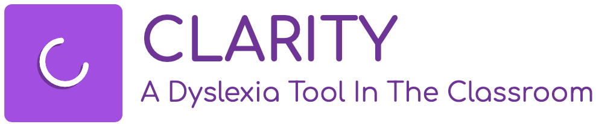

<p align="center">
  
</p>

<h1 align="center">Clarity</h1>
<h3 align="center">A Dyslexia Tool In The Classroom</h3>

---

## 🧠 About Clarity

**Clarity** is an accessibility-focused web app designed to support students with dyslexia in academic settings. It leverages AI to convert handwritten content and spoken lectures into clean, readable, and dyslexia-friendly notes.

With Clarity, students can customize their experience to suit their learning needs — including font options, reading modes, and real-time speech playback.

---

## ✨ Features

- 📝 **Handwritten to Text Notes**  
  Transcribe lecture board content into digital notes using computer vision + AI.

- 🔊 **Text-to-Speech Playback**  
  Read notes aloud with pause/resume and progress tracking.

- 🧩 **Custom Accessibility Controls**  
  Toggle between fonts like **Lexend** and **OpenDyslexic**, or choose from multiple contrast themes.

- 📚 **Course & Lecture Management**  
  Browse courses and view recent lectures in a structured layout.

- ✅ **Dyslexia-Friendly Interface**  
  Clean design, large readable text, and simplified UI for reduced cognitive load.

---

## 🖼️ Screenshots

> Coming soon! (Or drop some screenshots here using Markdown)

---

## 🚀 Getting Started

### 📦 Install Dependencies

```bash
npm install
